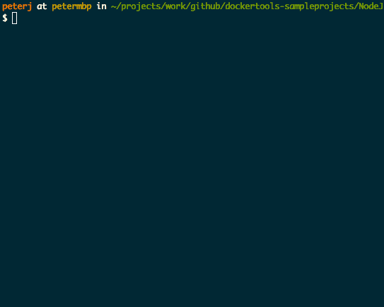

# Generator-docker

[![Package version][npmVersionBadge]][npmLink]
[![CI Status][ciStatusBadge]][ciLink]
[![Downloads][npmDownloadsBadge]][npmLink]

This generator creates a Dockerfile and scripts (`dockerTask.sh` and `dockerTask.ps1`) that helps you build and run your project inside of a Docker container. The following project types are currently supported:
- .NET Core
- Node.js
- Go

### Quick demo


## Longer walkthrough video
[![See the generator in action][yovideoScreenshot]][yovideo]]

## Installing

Prerequisites:
- [Node.js][nodejsSite]
- [Yo generator][yoSite]

Install the Docker generator:
```bash
npm install -g generator-docker
```

## Getting Started
Once yo docker and VS Code are installed, here's the few steps to debug your first app
### Node.js
- From the root of your project, where your server.js file exists, open a bash or powershell window
```bash
yo docker
```
- Answer the prompts, including your image name
- Open the file you wish to debug and set a breakpoint
- From VS Code, open the command palette (Mac: **[⌘]** + **[P]**, Windows: **[CTRL]** + **[P]**)
- Enter: `task composeForDebug` This will compose your containers using the dockerTask.sh script
- **[F5]** to start the node debugger within the container
- As we use `nodemon -L --debug-brk`, the debugger will break on the first line of your main file, so that you can debug the initialization of your app

### DotNet Core
- From the root of your project open a bash or powershell window
```bash
yo docker
```
- Answer the prompts, including your image name
- Open the file you wish to debug and set a breakpoint
- **[F5]** to start the .NET Core debugger within the container

## Contributing
See [Contributing][contributingLink] for guidelines

## Q&A
- **Q: Are you building an abstraction layer over docker apis?**
  - **A:** No. These are your scripts. We're simply providing a starting point that docker developers would write themselves. These scripts are based on customers we've been working with.
- **Q: Are you taking feedback?**
  - **A:** Of course. Please open an issue at [yodockerissues] or choose to [contribute][contributingLink].

## Collecting usage data
Generator-docker collects anonymized data on the options you selected in the tool to understand and improve the experience. You are given a choice to opt-in or opt-out first time you run the tool. If you opt-in and decide to opt-out later, simply delete the `~/.config/configstore/generator-docker.json` file from your machine.
However, we really need your feedback, so please help us help you by opting in.

## Version History
###v0.0.35
+ Added support for .Net Core Console Apps.
+ Updated Docker for Windows beta address to http://localhost
+ BugFix: Special characters in project names are now ignored.

### v0.0.34
+ Switch to using docker-compose for build.
+ BugFix: Add usage of ASPNETCORE_URLS Environment variable to support urls other than localhost for .NET Core.

### v0.0.33
+ Added support for .Net Core RTM.

### v0.0.32
+ Added integrated debugging using **[F5]** for both Node.js and .NET Core.
+ Changed to always generate bash and PowerShell scripts to enable cross-platform development.
+ Changed compose file to use the image created by build (introduced a tag to disambiguate debug and release image).
+ Removed usage of docker-machine in favor of defaults for Docker for Windows and Docker for Mac.

### v0.0.31
+ Added support for ASP.Net Core 5 RC2.
+ BigFix: Optimized the creation of the node image to take advantage of caching.

### v0.0.29
+ Fix for issue #34 (Update ASP.NET dockerfile and add support for RC).

### v0.0.27
+ Replaced .CMD file with PowerShell script.
+ Adding .debug and .release compose files.
+ Replaced ADD command with COPY command in dockerfile.

### v0.0.26
+ BugFix: fixing issues with the path on Windows when using volume sharing in Node.js projects.

### v0.0.25
+ BugFix: making sure config is defined before reading a property.
+ BugFix: tracking if users opted-in or out for data collection.

### v0.0.24
+ Docker-compose.yml files are being created now for all project types.

## License
See [LICENSE][licenseLink] for full license text.

[licenseLink]:https://github.com/Microsoft/generator-docker/blob/master/LICENSE
[contributingLink]: https://github.com/Microsoft/generator-docker/blob/master/CONTRIBUTING.md
[npmLink]:https://www.npmjs.com/package/generator-docker
[npmVersionBadge]:https://img.shields.io/npm/v/generator-docker.svg
[npmDownloadsBadge]:https://img.shields.io/npm/dm/generator-docker.svg
[ciStatusBadge]:https://circleci.com/gh/Microsoft/generator-docker.svg?style=shield&circle-token=a1a705d77cd91720fdd8b021e17c41bbabc4b00d
[ciLink]: https://circleci.com/gh/Microsoft/generator-docker
[yovideo]: https://youtu.be/p1F-398z1_4
[yovideoScreenshot]: http://img.youtube.com/vi/p1F-398z1_4/0.jpg
[nodejsSite]: https://nodejs.org/en/
[yoSite]: http://yeoman.io/
[yodockerprototype]: https://github.com/SteveLasker/YoDockerComposePrototype
[yodockerissues]: https://github.com/SteveLasker/YoDockerComposePrototype/issues
